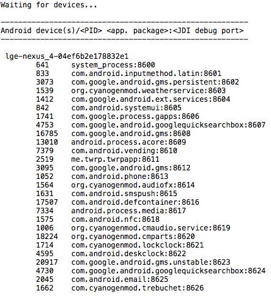

# NanoDDMS

This is a _nano_ version of Android Device Monitor (ADM, formerly known as DDMS). The only thing it can do is showing connected Android devices, Android processes with JDWP support, and JDWP debug ports. No heap info, threads, screenshots etc.



## Motivation

From time to time I debug third-party Android APKs. I use Android Studio with [smalidea](https://github.com/JesusFreke/smali/wiki/smalidea) as [described in my blog](https://kov4l3nko.github.io/blog/2018-01-20-debugging-thirdparty-android-java-code/). To connect a debugger to a process, I need to know its JDWP port. 

I usually use Android Device Monitor (ADM, formerly known as DDMS) to get the JDWP port. Unfortunately, Google reduced ADM development/support as much as possible, so ADM is getting more and more obsolete and slowly dying. As result, ADM may not run properly with the latest JDK/MacOS. Sometimes downgrading JDK helps (see [Tip #1 in my blog post](https://kov4l3nko.github.io/blog/2018-01-20-debugging-thirdparty-android-java-code/)). However, it looks like one day ADM will stop working on modern MacOS. So I wrote the "nano" replacement.

## Dependencies

The tool uses the following third-party JAR's:

* `animal-sniffer-annotations-1.14.jar`
* `common-26.0.0-dev.jar`
* `ddmlib-26.0.0-dev.jar`
* `error_prone_annotations-2.0.18.jar`
* `guava-22.0.jar`
* `j2objc-annotations-1.1.jar`
* `jsr305-1.3.9.jar`
* `kxml2-2.3.0.jar`

Find the JAR's in your Android SDK, or in `jar/lib/` folder in this repo.

## How to use

```
$ git clone https://github.com/kov4l3nko/nanoddms.git
$ cd jar/release/
$ java -jar nanoddms.jar <path/to/your/adb/binary> [<timeout>]
```

## Bugs

Sometimes DDMS server starts to out messages/errors in the console :) Not sure if it's a bug.

## Thanks

NanoDDMS code is heavily inspired by [iSECPartners Android SSL Bypass](https://github.com/iSECPartners/android-ssl-bypass). Thank you, guys! :)
